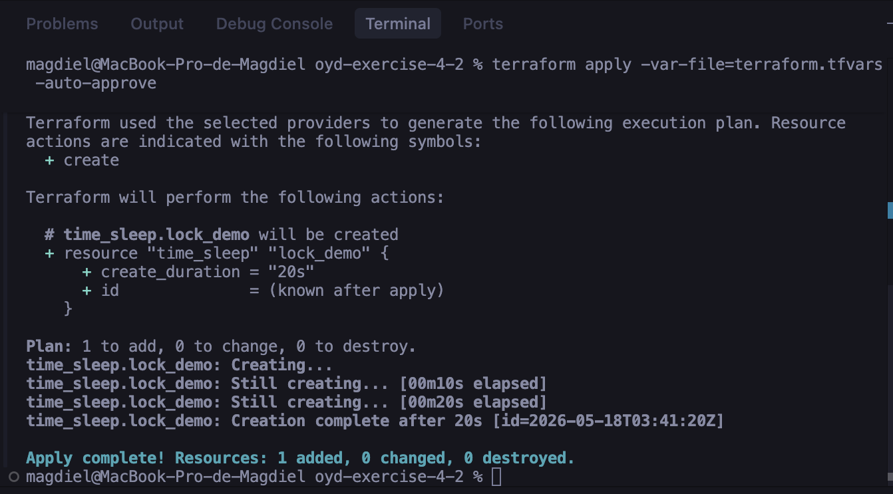
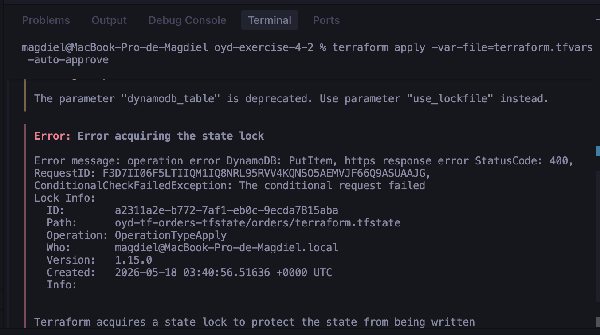

# Orders Service — Remote State Migration

## Descripción del Ejercicio
Este ejercicio demuestra la migración exitosa de un estado local de Terraform hacia un **Backend Remoto** utilizando **AWS S3** para el almacenamiento seguro del estado y **AWS DynamoDB** para el manejo de bloqueos (State Locking). Esta configuración asegura la integridad de la infraestructura, previene la corrupción de datos por ejecuciones concurrentes y representa una práctica fundamental y requerida en el despliegue en la nube.

## Evidence

A continuación se documenta la evidencia técnica que certifica el cumplimiento de todos los criterios de aceptación del ejercicio.

### 1. Estado Remoto Configurado
El estado de la infraestructura fue migrado exitosamente hacia el backend remoto. El siguiente listado confirma que Terraform está rastreando los recursos de forma remota:

**Salida de `terraform state list`:**
```text
aws_s3_bucket.order_attachments
time_sleep.lock_demo
```

### 2. Archivo de Estado en S3
Se verificó la existencia del archivo de estado físico dentro del bucket de S3 configurado, confirmando que Terraform está escribiendo remotamente con éxito:

**Salida de `aws s3 ls s3://oyd-tf-orders-tfstate/orders/`:**
```text
2026-05-17 21:41:21       3447 terraform.tfstate
```

### 3. Prueba de Contención de Bloqueo (Lock Contention)
Para validar el mecanismo de bloqueo a través de DynamoDB, se simularon dos ejecuciones concurrentes del comando `terraform apply`.

Primero, se inició la ejecución en la **Terminal 1**, la cual logró comunicarse con DynamoDB, adquirir el bloqueo de forma legítima y comenzar a aprovisionar los recursos de manera exitosa:



Inmediatamente después, mientras la primera ejecución seguía en progreso (aprovechando la ventana de tiempo del recurso `time_sleep`), se intentó iniciar una segunda ejecución en la **Terminal 2**. La tabla de DynamoDB actuó correctamente como árbitro al denegar esta segunda ejecución, protegiendo así el estado de modificaciones simultáneas y mostrando el respectivo error de adquisición de bloqueo:


